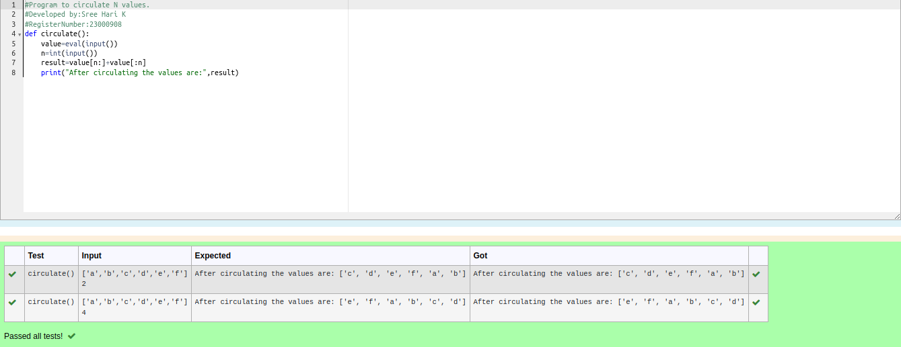

# Circulate-the-values-of-N-variables
## Aim:
To write a python program to circulate the n variables using function concept
## Equipment’s required:
PC
Anaconda - Python 3.7
## Algorithm: 
### Step 1: 
Define a function circulate().
### Step 2: 
Get the list from user.
### Step 3: 
Get the value from the user for the number of rotation..
### Step 4: 
Using the slicing concept rotate the list.

### Step 5: 
Print the circulated list.
### Step 6:
End the program.
## Program:
```python
#Program to circulate N values.
#Developed by:Sree Hari K 
#RegisterNumber:23000908
def circulate():
    value=eval(input())
    n=int(input())
    result=value[n:]+value[:n]
    print("After circulating the values are:",result)
```

## Output:


## Result:
Thus the program to circulate the N values is written and verified using python programming.
